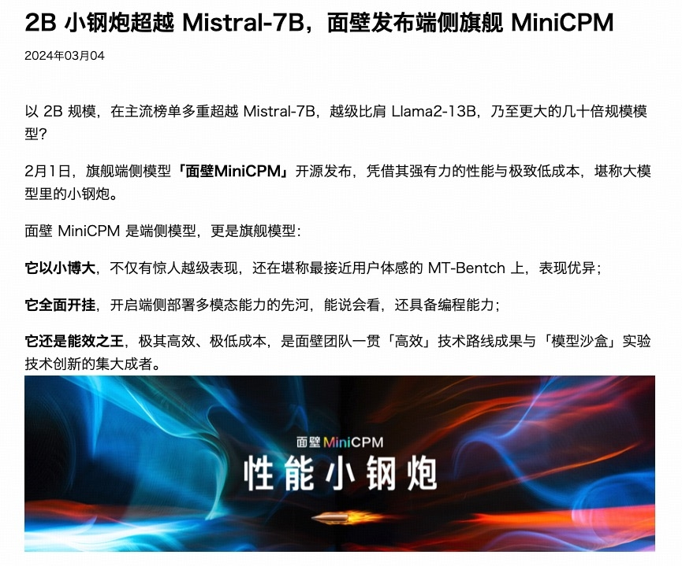

# OCR

### Initialize model

```python
from PIL import Image
import torch
from transformers import AutoModel, AutoTokenizer

model_path = 'openbmb/MiniCPM-V-4_5'
model = AutoModel.from_pretrained(model_path, trust_remote_code=True,
                                  attn_implementation='sdpa', torch_dtype=torch.bfloat16)  # sdpa or flash_attention_2, no eager
model = model.eval().cuda()
tokenizer = AutoTokenizer.from_pretrained(
    model_path, trust_remote_code=True)
```

### Usage example

```python
ocr_image = Image.open('./assets/ocr.png').convert('RGB')

question = "What is the text in the picture?"
msgs = [{'role': 'user', 'content': [ocr_image, question]}]

answer = model.chat(
    msgs=msgs,
    image=None,
    tokenizer=tokenizer
)
print(answer)
```

### Sample Image



### Example Output

```
2B小钢炮超越 Mistral-7B，面壁发布端侧旗舰 MiniCPM
2024年03月04

以2B规模，在主流榜单多重超越 Mistral-7B，越级比肩 Llama2-13B，乃至更大的几十倍规模模型？

2月1日，旗舰端侧模型「面壁MiniCPM」开源发布，凭借其强有力的性能与极致低成本，堪称大模型里的小钢炮。

面壁 MiniCPM 是端侧模型，更是旗舰模型：

它以小博大，不仅有惊人越级表现，还在堪称最接近用户体感的 MT-Bench 上，表现优异；

它全面开挂，开启端侧部署多模态能力的先河，能说会看，还具备编程能力；

它还是能效之王，极其高效、极低成本，是面壁团队一贯「高效」技术路线成果与「模型沙盒」实验技术创新的集大成者。

面壁 MiniCPM
性能小钢炮
```
