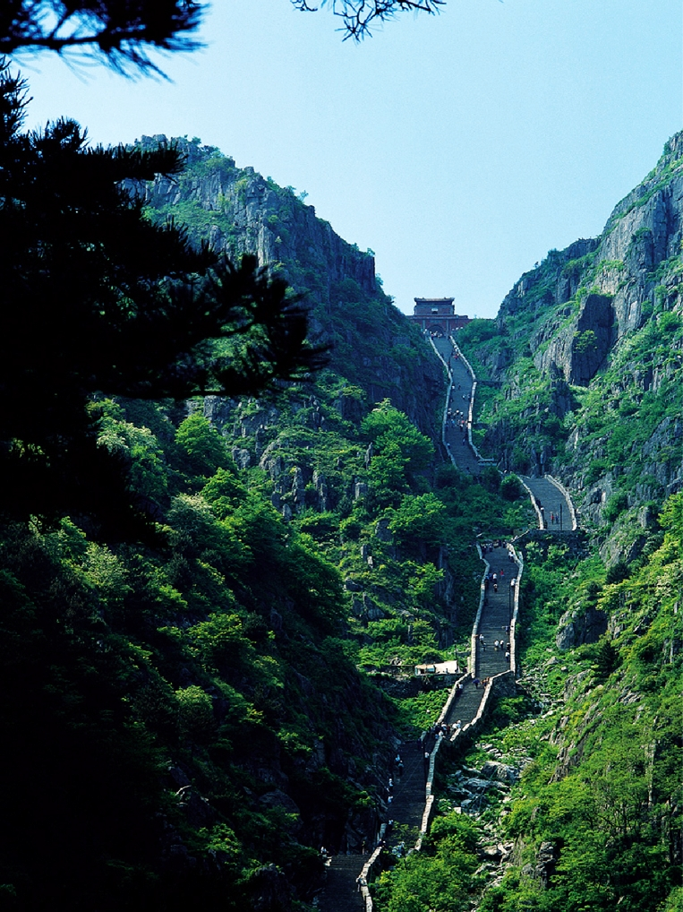

# Single Image

### Initialize model

```python
from PIL import Image
import torch
from transformers import AutoModel, AutoTokenizer

model_path = 'openbmb/MiniCPM-V-4_5'
model = AutoModel.from_pretrained(model_path, trust_remote_code=True,
                                  # sdpa or flash_attention_2, no eager
                                  attn_implementation='sdpa', torch_dtype=torch.bfloat16)
model = model.eval().cuda()
tokenizer = AutoTokenizer.from_pretrained(
    model_path, trust_remote_code=True)
```

### Chat with single image

```python
image = Image.open('./assets/single.png').convert('RGB')

# First round chat 
question = "What is the landform in the picture?"
msgs = [{'role': 'user', 'content': [image, question]}]

answer = model.chat(
    msgs=msgs,
    image=image,
    tokenizer=tokenizer
)
print(answer)
```

### Second round chat

```python
# Second round chat, pass history context of multi-turn conversation
msgs.append({"role": "assistant", "content": [answer]})
msgs.append({"role": "user", "content": [
            "What should I pay attention to when traveling here?"]})

answer = model.chat(
    msgs=msgs,
    image=None,
    tokenizer=tokenizer
)
print(answer)
```

### Sample Image



### Example Output

First round
```
The landform in the picture is a mountain range. The image shows steep cliffs, rugged terrain, and a winding path that ascends between two prominent rocky peaks covered with green vegetation. This type of landscape features high elevations and dramatic slopes characteristic of mountains.
```

Second round
```
When traveling to a mountainous area like this, it's important to pay attention to several factors. Firstly, be mindful of the steep paths and uneven terrain; wear appropriate footwear with good grip for safety. Secondly, stay hydrated as high altitudes can lead to dehydration more quickly than at sea level. Thirdly, check weather conditions before your trip since mountains can have sudden changes in weather which might affect visibility and trail conditions. Lastly, if you plan to hike or climb, carry essential supplies such as food, water, first aid kits, and navigation tools (maps or GPS) because help may not be readily available on remote trails.
```
