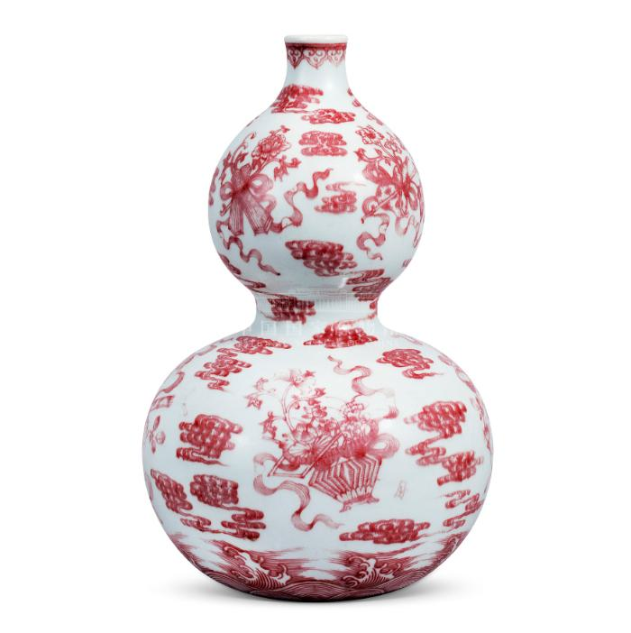
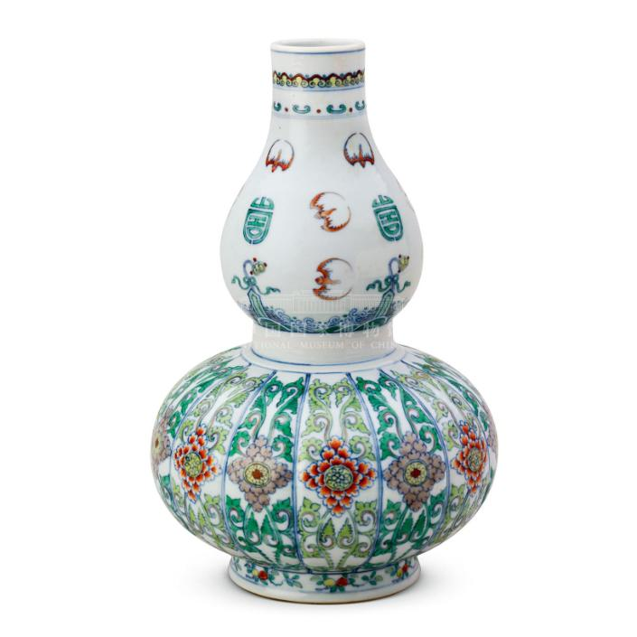

# Multi Images

### Initialize model

```python
from PIL import Image
import torch
from transformers import AutoModel, AutoTokenizer

model_path = 'openbmb/MiniCPM-V-4'
model = AutoModel.from_pretrained(model_path, trust_remote_code=True,
                                  attn_implementation='sdpa', torch_dtype=torch.bfloat16)  # sdpa or flash_attention_2, no eager
model = model.eval().cuda()
tokenizer = AutoTokenizer.from_pretrained(
    model_path, trust_remote_code=True)
```

### Chat with multiple images

```python
image1 = Image.open('assets/multi1.png').convert('RGB')
image2 = Image.open('assets/multi2.png').convert('RGB')
question = 'Compare the two images, tell me about the differences between them.'

msgs = [{'role': 'user', 'content': [image1, image2, question]}]

answer = model.chat(
    image=None,
    msgs=msgs,
    tokenizer=tokenizer
)
print(answer)
```

### Sample Images





### Example Output

```
The primary differences between the two images are the color schemes and patterns on the vases. In the first image, the vase is predominantly white with red designs, while in the second image, the vase features a combination of green, blue, orange, brown, black, and yellow colors. The pattern also differs; the first one has cloud motifs and abstract shapes, whereas the second shows more detailed floral and possibly symbolic imagery. These variations suggest that each vase may have been created for different purposes or cultural contexts, reflecting unique artistic styles or traditions.
```
