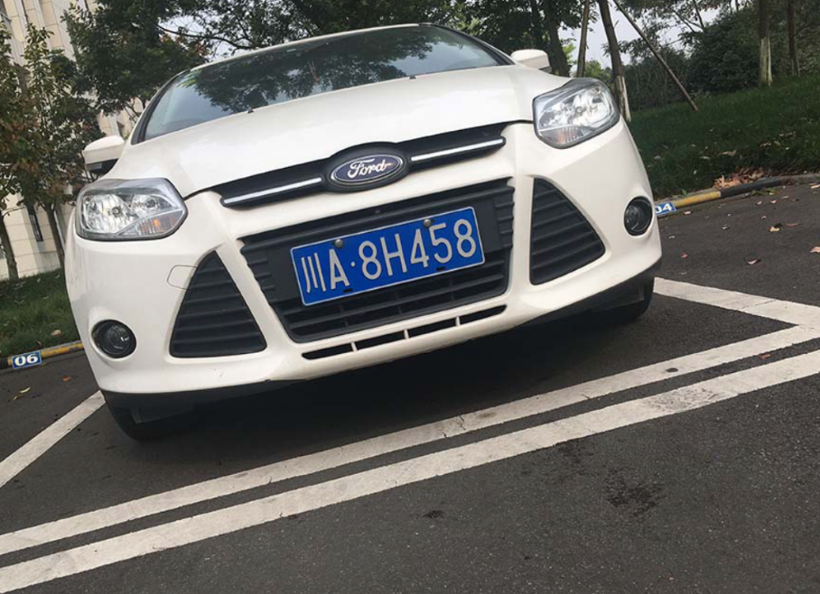

# Scene Text Recognize

### Initialize model

```python
import torch
from transformers import AutoModel, AutoTokenizer

model_path = 'openbmb/MiniCPM-V-4'
model = AutoModel.from_pretrained(model_path, trust_remote_code=True,
                                  attn_implementation='sdpa', torch_dtype=torch.bfloat16)  # sdpa or flash_attention_2, no eager
model = model.eval().cuda()
tokenizer = AutoTokenizer.from_pretrained(
    model_path, trust_remote_code=True)
```

### Usage example

```python
from PIL import Image

car_img = Image.open('./assets/car.png').convert('RGB')

prompt = """
Please detect and extract the vehicle’s license plate number from the image, and return only the plate text.
"""

contents = [prompt]
msgs = [{'role': 'user', 'content': [prompt, car_img]}]

answer = model.chat(msgs=msgs, image=None, tokenizer=tokenizer)
print(answer)
```

### Sample Image



### Example Output

```
Simple Answer: 川A·8H458

Revised Answer: To detect and extract the vehicle’s license plate number from the image, we need to carefully observe the area on the front of the car where the license plate is typically located. In this image, the license plate is clearly visible in the center of the front grille. The text on the license plate reads "川A·8H458". Therefore, the extracted license plate number is "川A·8H458".
```
